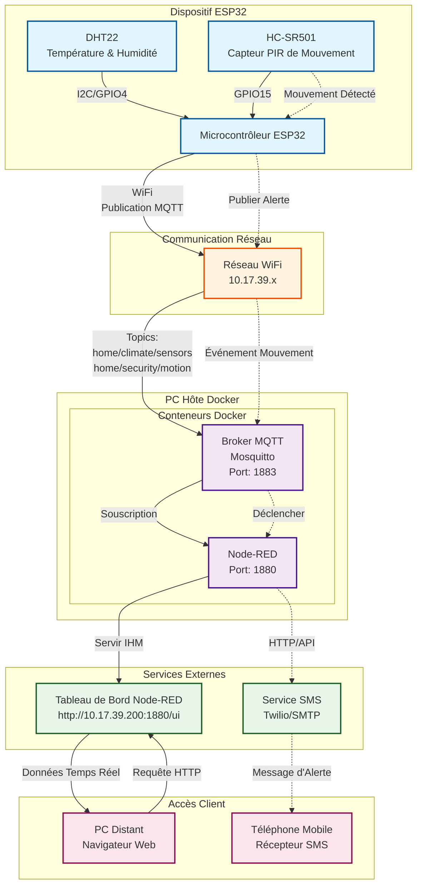

```mermaid
graph TB
    subgraph "Dispositif ESP32"
        ESP[Microcontrôleur ESP32]
        DHT[DHT22<br/>Température & Humidité]
        PIR[HC-SR501<br/>Capteur PIR de Mouvement]
        
        DHT -->|I2C/GPIO4| ESP
        PIR -->|GPIO15| ESP
    end
    
    subgraph "PC Hôte Docker"
        subgraph "Conteneurs Docker"
            MQTT[Broker MQTT<br/>Mosquitto<br/>Port: 1883]
            NR[Node-RED<br/>Port: 1880]
        end
    end
    
    subgraph "Communication Réseau"
        WIFI[Réseau WiFi<br/>10.17.39.x]
    end
    
    subgraph "Services Externes"
        SMS[Service SMS<br/>Twilio/SMTP]
        DASH[Tableau de Bord Node-RED<br/>http://10.17.39.200:1880/ui]
    end
    
    subgraph "Accès Client"
        PC2[PC Distant<br/>Navigateur Web]
        PHONE[Téléphone Mobile<br/>Récepteur SMS]
    end
    
    %% Flux de Données
    ESP -->|WiFi<br/>Publication MQTT| WIFI
    WIFI -->|Topics:<br/>home/climate/sensors<br/>home/security/motion| MQTT
    
    MQTT -->|Souscription| NR
    
    %% Flux d'Alerte Détection de Mouvement
    PIR -.->|Mouvement Détecté| ESP
    ESP -.->|Publier Alerte| WIFI
    WIFI -.->|Événement Mouvement| MQTT
    MQTT -.->|Déclencher| NR
    NR -.->|HTTP/API| SMS
    SMS -.->|Message d'Alerte| PHONE
    
    %% Accès au Tableau de Bord
    NR -->|Servir IHM| DASH
    PC2 -->|Requête HTTP| DASH
    DASH -->|Données Temps Réel| PC2
    
    %% Style
    classDef hardware fill:#e1f5fe,stroke:#01579b,stroke-width:2px
    classDef software fill:#f3e5f5,stroke:#4a148c,stroke-width:2px
    classDef network fill:#fff3e0,stroke:#e65100,stroke-width:2px
    classDef external fill:#e8f5e9,stroke:#1b5e20,stroke-width:2px
    classDef client fill:#fce4ec,stroke:#880e4f,stroke-width:2px
    
    class ESP,DHT,PIR hardware
    class MQTT,NR software
    class WIFI network
    class SMS,DASH external
    class PC2,PHONE client
``` 